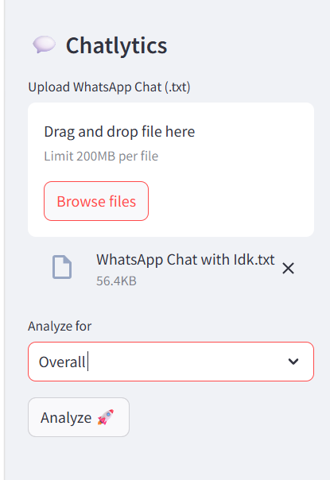
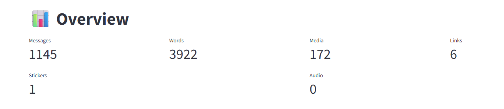
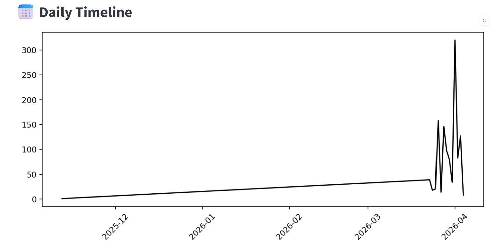
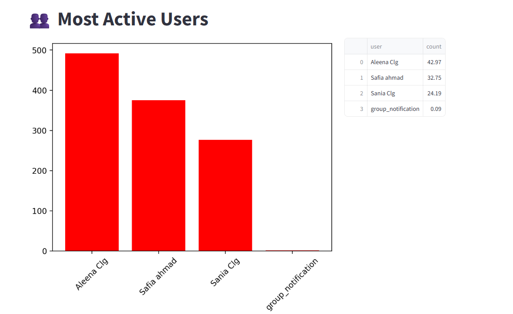
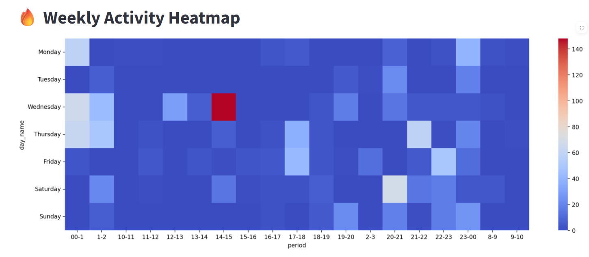
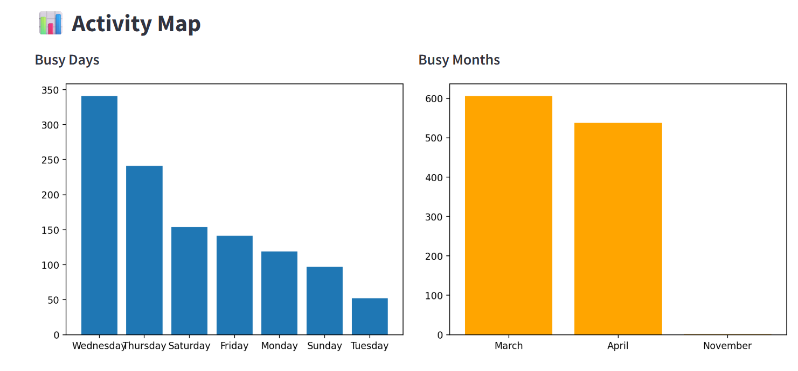

# 💬 Chatlytics – WhatsApp Chat Analyzer

A Streamlit-based data analysis application that extracts meaningful insights from exported WhatsApp chats. The system processes raw chat data and visualizes user behavior, communication patterns, and sentiment using Python-based data analysis and visualization techniques.

---

## 🚀 Live App

---

## 📸 Screenshots

### 🏠 Home

### 📊 Overview Stats

### 📈 Daily Timeline

### 🔥 Activity Map

### 🌡️ Heatmap

### 😂 Emoji Analysis

### 👥 Busy Users

---

## 📌 Project Overview

With the growing use of messaging platforms, large volumes of conversational data are generated daily. However, this data often remains unstructured and underutilized.

This project transforms WhatsApp chat data into meaningful insights using data preprocessing, natural language processing (NLP), and visualization techniques.

Users can upload exported WhatsApp chat files and instantly get:

- Message statistics  
- Activity trends over time  
- User participation analysis  
- Word frequency insights  
- Emoji usage patterns  
- Sentiment analysis  

---

## 🎯 Objectives

- Build an end-to-end data analysis pipeline for WhatsApp chat data  
- Handle multiple chat formats (12-hour & 24-hour timestamps)  
- Provide interactive visual insights using Streamlit  
- Implement NLP techniques for text cleaning and sentiment analysis  
- Create a clean and user-friendly web interface  

---

## 🧠 Methodology

### Data Processing
- Regex-based parsing of WhatsApp chat exports  
- Extraction of:
  - Users  
  - Messages  
  - Timestamps  
- Supports:
  - 24-hour format  
  - AM/PM format  

### Feature Engineering
Derived features include:
- Year, Month, Day  
- Day name (Monday–Sunday)  
- Hour-based time intervals  
- Message counts per time unit  

---

## 📊 Features

✔ Real-time WhatsApp chat analysis  
✔ Supports multiple time formats  
✔ Interactive visualizations  
✔ Emoji and sentiment insights  
✔ Clean and responsive UI  

---

## 📊 Analysis Modules

### 📈 Timeline Analysis
- Monthly and daily message trends  

### 🔥 Activity Analysis
- Most active days and months  
- Hour-wise activity heatmap  

### 👥 User Analysis
- Most active users  
- Contribution percentage  

### ☁️ Text Analysis
- WordCloud visualization  
- Most common words (stopwords removed)  

### 😂 Emoji Analysis
- Most frequently used emojis  
- Pie chart visualization  

### 😊 Sentiment Analysis
- Positive / Negative / Neutral classification  
- Implemented using TextBlob  

---

## ⚙️ System Architecture

Raw WhatsApp Chat (.txt)  
        ↓  
Preprocessing (Regex + Parsing)  
        ↓  
Feature Engineering  
        ↓  
Analysis Functions (helper.py)  
        ↓  
Visualization (Matplotlib + Seaborn)  
        ↓  
Streamlit Web Interface  

---

## 🛠️ Technologies Used

- Python  
- Streamlit  
- Pandas  
- Matplotlib  
- Seaborn  
- WordCloud  
- TextBlob  
- Regex  

---

## 🚧 Limitations

- Sentiment analysis may not work well for Hinglish/slang  
- No multimedia content analysis  
- Depends on WhatsApp export format consistency  

---

## 🔮 Future Improvements

- Advanced NLP models (BERT)  
- Topic modeling for conversations  
- Relationship insights between users  
- Emotion detection  
- Full SaaS deployment  

---

## ▶️ How to Run the Project

git clone https://github.com/safia-ahmad/whatsapp-chat-analysis.git  
cd whatsapp-chat-analysis  
pip install -r requirements.txt  
streamlit run app.py  

---

## 👤 Author

Safia Ahmad  
BCA

---

## ✅ Conclusion

This project demonstrates how unstructured conversational data can be transformed into actionable insights using data analysis and visualization techniques. It combines efficient preprocessing, insightful analytics, and a user-friendly interface to deliver a practical chat analysis tool.
